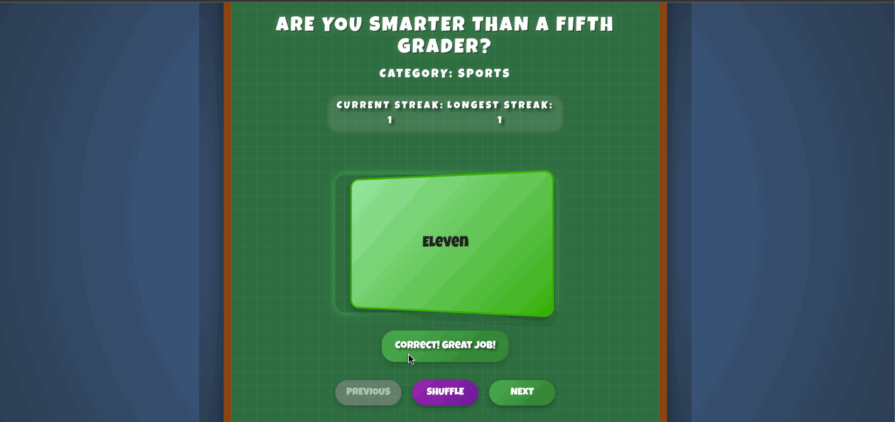

# Web Development Project 2 & 3 - *Smarter Than Fifth Grader Trivia*

Submitted by: **Aditya Koul**

This web app: **A trivia flashcard app that has a similar format to the popular TV show *Are You Smarter than a Fifth Grader?***

Time spent: **6** hours spent in total

## Required Features

The following **required** functionality is completed:

- [x] **The user can enter their guess in a box before seeing the flipside of the card**
- [x] **Clicking on a submit button shows visual feedback about whether the answer was correct or incorrect**
- [x] **A back button is displayed on the card and can be used to return to the previous card in a set sequence**
- [x] **A next button is displayed on the card and can be used to navigate to the next card in a set sequence**

The following **optional** features are implemented:

- [x] A shuffle button is used to randomize the order of the cards
- [x] A user's answer may be counted as correct even when it is slightly different from the target answer
- [x] A counter displays the user's current and longest streak of correct responses
- [ ] A user can mark a card that they have mastered and have it removed from the pool of answers as well as added to a list of mastered cards

The following **additional** features are implemented:

* [x] The user can choose to flip the card over if they do not know the answer, but then they cannot answer and the streak resets
* [x] Added a tracker for the category of each card
* [x] Added animations for card flips
* [x] Cards have different visual styles such as color based on their category
  * [x] *Each subject (Math, Science, History, etc.) has its own color scheme*

## Video Walkthrough

Here's a walkthrough of implemented required features:

GIF created with LICEcap  

## Notes

I had a little bit of trouble with the animations of the cards. Pressing different buttons in certain cases prompted different animations so I had to create separate classes for these cases. Other than that, the project was fairly straightforward. Making it look adequate also took significant time, but I am happy with the way it turned out.

When I came back to improve the project (Week 3), everything went fairly smoothly because I already had done most of the work previously

## License

    Copyright 2025 Aditya Koul

    Licensed under the Apache License, Version 2.0 (the "License");
    you may not use this file except in compliance with the License.
    You may obtain a copy of the License at

        http://www.apache.org/licenses/LICENSE-2.0

    Unless required by applicable law or agreed to in writing, software
    distributed under the License is distributed on an "AS IS" BASIS,
    WITHOUT WARRANTIES OR CONDITIONS OF ANY KIND, either express or implied.
    See the License for the specific language governing permissions and
    limitations under the License.