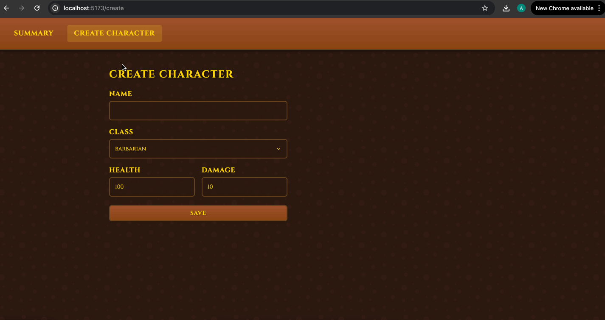

# Web Development Project 8 - *Team Assembler*

Submitted by: **Aditya Koul**

This web app: **allows users to create, view, edit, and delete characters for a medieval battle team. Each character has a name, class (barbarian, archer, wizard, giant, or skeleton), health, and damage attributes. The app features a medieval theme inspired by Clash Royale with rich visual styling.**

Time spent: **3** hours spent in total

## Required Features

The following **required** functionality is completed:

- [x] **The web app contains a page that features a create form to add a new character**
  - Users can name the character
  - Users can select the character's class from predefined options
  - Users can set the character's health and damage attributes
- [x] **The web app includes a summary page of all the user's added characters**
  - The web app contains a summary page dedicated to displaying all the characters the user has made so far
  - The summary page is sorted by creation date such that the most recently created characters appear at the top
- [x] **A previously created character can be updated from the list of characters in the summary page**
  - Each character has an edit button that will take users to an update form for the relevant character
  - Users can see the current attributes of their character on the update form
  - After editing the character's attribute values using the form, the user can immediately see those changes reflected in the update form and on the summary page 
- [x] **A previously created character can be deleted from the character list**
  - Using the edit form detailed in the previous _characters can be updated_ feature, there is a button that allows users to delete that character
  - After deleting a character, the character should no longer be visible in the summary page
- [x] **Each character has a direct, unique URL link to an info page about them**
  - Clicking on a character in the summary page navigates to a detail page for that character
  - The detail page contains extra information about the character not included in the summary page
  - Users can navigate to the edit form from the detail page

The following **optional** features are implemented:

- [x] A character can be given a class upon creation which provides unique descriptions
  - Users can choose from five different character classes: barbarian, archer, wizard, giant, or skeleton
  - Each class has a unique, humorous description that appears on the character detail page
  - The class selection affects the character's appearance in the summary and detail views
- [x] The summary page displays a custom "success" metric about a user's team which changes the look of the character list
  - The medieval theme with rich visual styling creates an immersive experience
  - Character cards have hover effects that elevate them, creating a dynamic feel
  - The color scheme and typography enhance the medieval battle theme

The following **additional** features are implemented:

* [x] **Rich Medieval Theme**: The app features a Clash Royale-inspired medieval theme with:
  - Custom color scheme with browns and golds
  - Medieval typography using the Cinzel font
  - Text shadows and gradients for depth
  - Interactive hover effects on buttons and cards
  - Custom styling for form elements
* [x] **Responsive Design**: The app is fully responsive and works well on different screen sizes
* [x] **Character Class Descriptions**: Each character class has a unique, humorous description that appears on the detail page
* [x] **Visual Feedback**: Interactive elements provide visual feedback through hover effects and transitions
* [x] **Supabase Integration**: The app uses Supabase for data storage and retrieval

## Video Walkthrough

Here's a walkthrough of implemented required features:

GIF created with LICEcap

## Notes

This project went fairly smoothly. After figuring out the Supabase variables in the `.env` file to conceal the API key and URL, the rest of the project was simple. I had fun building this project

## License

    Copyright 2025 Aditya Koul

    Licensed under the Apache License, Version 2.0 (the "License");
    you may not use this file except in compliance with the License.
    You may obtain a copy of the License at

        http://www.apache.org/licenses/LICENSE-2.0

    Unless required by applicable law or agreed to in writing, software
    distributed under the License is distributed on an "AS IS" BASIS,
    WITHOUT WARRANTIES OR CONDITIONS OF ANY KIND, either express or implied.
    See the License for the specific language governing permissions and
    limitations under the License.