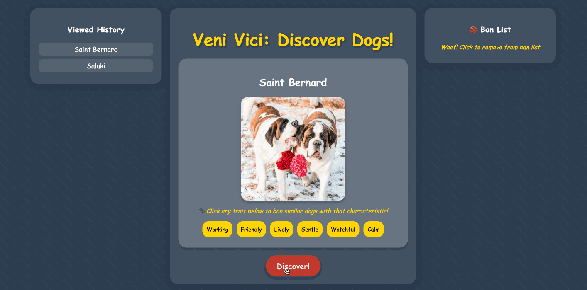

# Web Development Project 4 - *Dog Veni Vici*

Submitted by: **Aditya Koul**

This web app: **This is a Veni Vici style app where the user can discover thousands of dog breeds. They can ban certain attributes they do not like and the app filters the breeds to the user's taste**

Time spent: **5** hours spent in total

## Required Features

The following **required** functionality is completed:

- [X] **Clicking a button creates a new API fetch request and displays at least three attributes from the returned JSON data**
- [X] **Only one item/API call is viewable at a time**
- [X] **API calls appear random to the user**
- [X] **At least one image is displayed per API call**
- [X] **Clicking on a displayed value for one attribute adds it to a displayed ban list**
  - [X] To ensure an accurate grade, your recording **must** show that when clicked, an attribute in the ban list is immediately removed from the list of banned attributes
- [X] **Attributes on the ban list prevent further images/API results with that attribute from being displayed**

The following **optional** features are implemented:

- [X] Multiple types of attributes can be added to the ban list
- [X] Users can see a stored history of their previously viewed items from their session

The following **additional** features are implemented:

* [X] Attributes can be removed from the ban list to be used to discover new dog breeds
* [X] Custom loading screen implemented when waiting for API call and new breed to be found according to ban list

## Video Walkthrough

Here's a walkthrough of implemented user stories:

GIF created with LICEcap

## Notes

I first wanted to build this app to look for cars. However, the car API I chose was buggy and did not work properly so I pivoted to dogs. After I switched APIs, the project went fairly smoothly

## License

    Copyright 2025 Aditya Koul

    Licensed under the Apache License, Version 2.0 (the "License");
    you may not use this file except in compliance with the License.
    You may obtain a copy of the License at

        http://www.apache.org/licenses/LICENSE-2.0

    Unless required by applicable law or agreed to in writing, software
    distributed under the License is distributed on an "AS IS" BASIS,
    WITHOUT WARRANTIES OR CONDITIONS OF ANY KIND, either express or implied.
    See the License for the specific language governing permissions and
    limitations under the License.